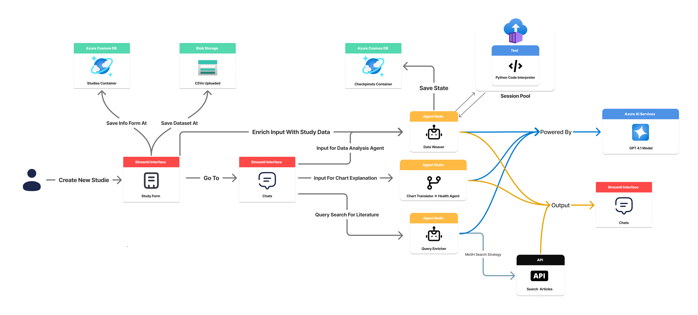

# BioLit Explorer 🧬📚

**An Integrated AI Assistant for Accelerating Biomedical Research by Connecting Data Analysis with Scientific Literature.**


**[[Test BioLit Explorer](https://biolitexplorer.streamlit.app/)]** | **[[See a Demo](https://biolitexplorer.streamlit.app/](https://drive.google.com/file/d/14Tdm538XxBCTZ5-huOnp-KwkkrWADxej/view?usp=sharing )]**

[](https://www.python.org) [](https://streamlit.io) [](https://python.langchain.com/docs/langgraph/) [](https://azure.microsoft.com) [](https://www.ncbi.nlm.nih.gov/books/NBK25501/) [](https://opensource.org/licenses/MIT)

---

## Overview

BioLit Explorer is an interactive web platform built with Streamlit and LangGraph designed for biomedical researchers. It streamlines the research process by connecting user-uploaded data analysis (CSV) with relevant scientific literature from **PubMed**. Through a dual conversational interface, users can **explore their data, generate visualizations, test hypotheses**, and simultaneously obtain **contextualized** and **scientific articles**, accelerating the generation of insights and the formulation of new hypotheses.

<br>

## 🎯 The Problem Addressed

Biomedical research faces the challenge of efficiently connecting the results of experimental data analysis with the vast scientific literature. This manual process is time-consuming and prone to omissions, slowing down the discovery cycle. BioLit Explorer aims to overcome this bottleneck by offering an integrated and intelligent tool.

<br>

## 💡 The Solution: BioLit Explorer

Our solution uses a multi-agent architecture orchestrated by LangGraph to provide a cohesive workflow:

1. **Study Setup:** The user starts by uploading their dataset (CSV) and providing contextual details through an initial form in the Streamlit interface. This information and the dataset are stored securely in Azure.

2. **Interactive Data Analysis:** In the “Data Analysis” chat, the user interacts in natural language. A dedicated agent, using Python code execution tools (via Azure Container Apps Session Pools), interprets the requests, performs analysis (Pandas) on the dataset, and returns results and visualizations.

3. **Enriched Literature Search:** In the "Scientific Literature" chat, PubMed searches (via Entrez API) are enhanced by an agent that refines the user's query using the **MeSH (Medical Subject Headings)** strategy, ensuring more relevant results.

4. **State Management:** Azure Cosmos DB is used to persist the state of conversations and study metadata.

5. **Unified Interface:** The Streamlit interface presents chats and results side by side.
   
<br>

## 🏛️ Architecture and Flow



The diagram above illustrates the main flow of the application, from study creation to interaction with data analysis and literature search agents, using Azure services for storage, code execution, and AI models.

## 📂 Repository Structure

```
.
├── src/ # Main source code
│ ├── app/ # Core application logic
│ │ ├── graphs/ # LangGraph graph definitions
│ │ ├── prompts/ # Prompt files (.prompty or similar)
│ │ ├── services/ # Modules to interact with external APIs and services (Azure, PubMed, etc.)
│ │ │ └── azure_clients.py # Azure client configuration (e.g. Cosmos, Blob)
│ │ │ └── pubmed_client.py # Logic for Entrez API
│ │ │ └── ...
│ │ ├── tools/ # LangChain/LangGraph custom tools
│ │ └── __init__.py
│ └── __init__.py
├── .env.example # Example file for environment variables
├── .gitignore
├── app.py # Streamlit application entry point
├── requirements.txt # Python dependencies
└── README.md # This file
```

*   **`app.py`:** Entry point that initializes and runs the Streamlit interface.
*   **`src/app/`:** Contains modular logic:
    *   **`graphs/`:** Ddefines the execution graphs of the agents using LangGraph.
    *   **`prompts/`:** Stores the prompt templates that guide LLMs.
    *   **`services/`:** Encapsulates communication with external Azure services and the PubMed API.
    *   **`tools/`:** Implements tools that LangChain agents can invoke (e.g. code execution).

## 🚀 Accessing the Application

The application is deployed and can be accessed directly through the following link:

**[[Accces BioLit Explorer](https://biolitexplorer.streamlit.app/)]**

No local installation or configuration is required to test the application.

## 🛠️ Technologies Used

* **Python (3.9+):** Main language for all backend, agent logic and Streamlit interface.

* **Streamlit:** Framework used to build and deploy the interactive web interface quickly and efficiently, allowing the creation of chat panels and visualization of results.

* **LangChain / LangGraph:** Core library for orchestration of the application. LangGraph is used to define the complex control flow between multiple agents (Data Analysis, Query Enricher, etc.), managing the state of the conversation and the execution of tasks. LangChain provides the building blocks (LLMs, tools, prompts, memory).

* **Azure Services:**
  * **Azure Cosmos DB:** Used as a NoSQL database to store user study metadata, agent memory and LangGraph checkpoints, ensuring persistence and state recovery. Authentication can be via Connection String or RBAC.
  * **Azure Blob Storage:** Used for secure and scalable storage of datasets (CSV/TSV/XLSX files) uploaded by users. Files are referenced from metadata in Cosmos DB. Authentication is done via RBAC/AAD.
  * **Azure Container Apps Session Pools (via `langchain-azure-dynamic-sessions`):** Provides a secure and isolated environment for executing Python/Pandas code on demand, triggered by LangChain's `SessionsPythonREPLTool` tool. Allows analysis of uploaded data without compromising the main application environment. * **Azure OpenAI Service:** Can be configured as the provider of the language model (GPT-4.1) used by LangChain/LangGraph agents for natural language understanding, code generation, and responses.
  * **Azure Identity:** Used for secure authentication to backend services in Azure resources (Blob, Cosmos, Session Pools) through `DefaultAzureCredential` or `EnvironmentCredential`, typically using Service Principals or Managed Identities (no deploy).

* **NCBI Entrez E-utilities API (PubMed):** Used by the Literature Agent to perform programmatic and systematic searches in the PubMed database, retrieving abstracts and metadata of scientific articles.

* **Pandas:** Essential Python library used within the code execution environment (Session Pools) to load, manipulate, and analyze tabular data from CSV files uploaded by users.

## 📖 Basic Usage

1. Access the URL of the deployed application.
2. Follow the on-screen instructions to start a new study by uploading your data file and providing context.
3. Interact with the "Data Analysis" and "Scientific Literature" chat panels to conduct your research.

